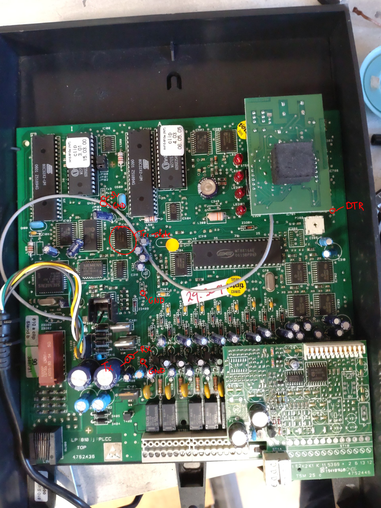
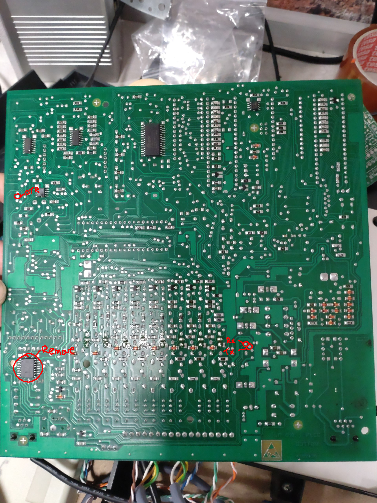

# Tiptel 810 S clip programming interface
This project connects to the (old square model) Tiptel 810 S serial port to read and write settings and call data.
For programming with both extension 1 and using serial, you need to put the switch in "program" mode

This is currently a work in progress; the protocol is more or less decoded, but not all commands are known or documented.

## Getting started
The tool assumes USB serial connected to `/dev/ttyUSB0`

Install dependencies:
* `npm i`

Run the "test" tool:
* `npm test`

## TTL modification
* Remove the AN232B chip on the bottom left side on the back of the PCB
* Tap into the vias:
  * TX, RX: near the big electrolytic capacitors
  * VCC: header between the processors at the top
  * GND: header between the processors at the top  
  also the bottom pin of the 3 pin header near the big electrolytic capacitors
  * DTR: below the CLIP addon board/header

Look into the resources folder for full resolution images.

## pincodes 
* programming code is 1111
* call charge code is 2222

## FRITZ!Box notes
* FRITZ!Box does not send Advice Of Charge (AOC pulse) needed for cost center calculations

## Instructions
Note that all instructions are noted in hexadecimal; `10` means `16` in decimal or `00010000` in binary.

Steps for a message exchange:

* set DTR low, wait for 3 `05` 'heartbeat' messages (about 190mS)
* send `attention length data.. checksum`, where:
    * `attention` is `06`
    * `length` is the length of the data + checksum, 1 byte
    * `data..` is probably an EEPROM address or command (to be determined)
    * `checksum` is an XOR of the data only (if one byte, it'll be the same byte), 1 byte
* receive `attention modifier?`, where:
    * `attention` always seems `06`
    * `modifier` always seems +`01`; `80` becomes `81`
* send `attention`
* receive `length addr... data...` checksum, where:
    * `length` is the length of the addr + data + checksum, 1 byte
    * `addr` seems 1 or 2 bytes, seems XORed with the modifier (second byte differs per response so the address or command width might be variable)
    * `data` might have decimal numbers mapped to hexadecimal, i.e. `01 96` represents MSN `196`
    * `checksum` is an XOR of the address + data, 1 byte
* set DTR high and send `attention` (EOT actually)

Special bytes:
### ready
* `01`
### apply/store
* `04`
### heartbeat
* `05`
### attention/ACK
* `06`

These commands are part of the data (the attention and length byte are stripped for readability)
### read ISDN version (from other µC)
* rd: `80 13`
* rd response: `81 14 ?? ?? ?? vv vv rr rr dd dd mm mm yy yy yy yy ss pp 00`, where:
  * `vv` is (major) version in ASCII
  * `rr` is revision (minor version) in ASCII
  * `dd` is day of month in ASCII
  * `mm` is month in ASCII
  * `yy` is year in ASCII
  * `ss` is state of operation: `00`=disconnected, `02`=PTMP
  * `pp` is state of programming mode: `00`=normal, `01`=programmable
### read analog version
* rd: `A0`
* rd response: `A1 ?? ?? ?? vv vv rr rr dd dd mm mm yy yy yy yy`, where:
  * `vv` is (major) version in ASCII
  * `rr` is revision (minor version) in ASCII
  * `dd` is day of month in ASCII
  * `mm` is month in ASCII
  * `yy` is year in ASCII

## generic settings
* rd: `AC`
* rd response: `AD mm ??`, where:
  * `mm` probably are bit flags: `??em????`:
    * `e`: `true`: external music on hold (only when `m` enabled), `false`: internal MOH
    * `m` is music on hold enabled

## extension features
* rd: `B0`
* rd response: `B1 ad an rd rn ld ln id in md mn bd bn cd cd cn cn cf ct`, where:
  * `ad` are extension bits: external access authorization day service
  * `an` are extension bits: external access authorization night service
  * `rd` are extension bits: external ringing signal day service
  * `rn` are extension bits: external ringing signal night service
  * `ld` are extension bits: long-distance dialling day
  * `ln` are extension bits: long-distance dialling night
  * `id` are extension bits: international dialling day
  * `in` are extension bits: international dialling night
  * `md` are extension bits: authorization memory dialling day
  * `mn` are extension bits: authorization memory dialling night
  * `bd` are extension bits: directory of blocked numbers activated day
  * `bn` are extension bits: directory of blocked numbers activated night
  * `cd cd` are extension crumbles: cost center during day service
    * `00`: 1, `01`: 2, `10`: 3
  * `cn cn` are extension crumbles: cost center during night service
    * `00`: 1, `01`: 2, `10`: 3
  * `cf` are extension bits: authorization call forwarding
  * `ct` are extension bits: authorization call transfer

## unknown B4/B6

## command B8/BA
TODO (12 bytes)

## command BC/BE
TODO (7 bytes)

## command C0/C2
TODO (5 bytes)

## PIN
* rd: `C4 tt`
* wr: `C6 tt dd dd`
* special bytes:
  * `tt` is type: `01`=call charge, `02`=programming
  * `dd` is two PABX digits (`A`=0)

## MSN allocation
* rd: `C8`
* rd response: `C9 bb bb bb bb bb bb bb bb bb bb`
* wr: `CA bb bb bb bb bb bb bb bb bb bb`
* special bytes:
  * `bb` are bits (TODO)

## MSN assignment
* rd: `CC ii`
* rd response: `CD ii dd dd dd dd dd dd dd dd`
* wr: `CE ii dd dd dd dd dd dd dd dd`
* special bytes:
  * `ii` is index `00..0A`, yes 11 assignments according to the original software
  * `dd` is two PABX digits (`A`=0)

## command D0/D2
TODO (index 0-9 + 10 bytes)

## command D4/D6
TODO (index 0-4 + 8 bytes)

## speed dial
* rd: `D8 ii`
* rd response: `D9 ii dd dd dd dd dd dd dd dd dd dd`
* wr: `DA ii dd dd dd dd dd dd dd dd dd dd`
* special bytes:
  * `ii` is index `00..63`
  * `dd` is two PABX digits (`A`=0)
## read call charges (DB, note command offset!)
* rd: `DB yy mm dd yy mm dd`
* rd response: `DC tt`
* special bytes:
  * `yy` is year in ASCII
  * `mm` is month in ASCII
  * `dd` is day in ASCII
  * `tt` total amount of entries

## read next entry (DE note command offset!)
* rd: `DE`
* rd response: `DD ee yy mm dd hh nn`
* special bytes:
  * `ee` is entry number
  * `yy` is year in ASCII
  * `mm` is month in ASCII
  * `dd` is day in ASCII
  * `hh` is hour in ASCII
  * `nn` is minute in ASCII

## command E0/E2
TODO (4 bytes)

## unknown E4/E6

## unknown E8/EA

## unknown EC/EE

## Notes
* The CLIP addon board needs to be placed (including the gray cable) to have the ring signal
* The intercom board needs to be placed to make sure extension 8 has a dial tone

